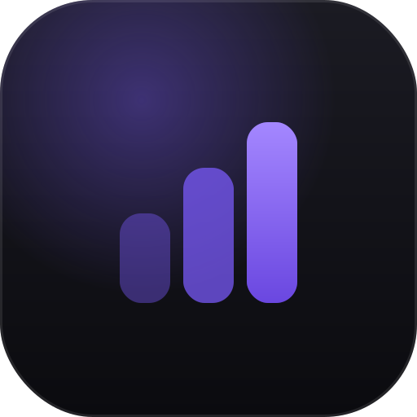

<div align="center">



# Croustylift

**Tracker de musculation — capture zéro-friction en salle, analyse au calme.**

Logge chaque série en un geste, le téléphone à bout de bras sous les néons.
Lis ta progression réelle au calme, façon cadran d'instrument.

[](./LICENSE)
[](#pwa--offline-first)


</div>

---

## Le pitch

La plupart des trackers te forcent à te battre avec l'app au pire moment — fatigué, pressé,
entre deux séries — puis noient la seule vraie question (**« est-ce que je progresse ? »**)
sous des données brutes.

Croustylift sépare radicalement **deux moments** :

| 🏋️ Capture *(en salle)* | 📈 Analyse *(au calme)* |
|---|---|
| Minimale et increvable. Un tap, au pouce, **jamais de clavier**. Offline d'abord. | Riche et posée. Courbe e1RM façon Apple Fitness, décompte par muscle, comparaison de blocs. |

Projet perso (et quelques potes). PWA installable, **offline-first**, **0 € d'infra**.

## Fonctionnalités

**Capture en salle**
- Logging d'une série en **1 tap**, cible « à battre » déjà affichée.
- Steppers custom au pouce (poids / reps / RIR) — **jamais le clavier OS**.
- Exercices **unilatéraux** (logging du côté faible), ajout / remplacement d'exo à la volée.
- **Offline-first** : écriture locale immédiate, file d'attente de sync (last-write-wins).

**Analyse au calme**
- **Courbe e1RM** estimée (max théorique à 1 rép), trend par bloc, journal brut auditable.
- **Décompte de séries par muscle** principal, pondéré par les reps.
- Comparaison **bloc courant vs précédent**.

**Organisation**
- Routines → séances → **prescriptions** (séries × fourchette de reps × RIR).
- Catalogue d'exercices **base + perso**, personnalisation par utilisateur.

**Données & plateforme**
- **Export / import** JSON de tout l'historique.
- Multi-utilisateur (toi + potes), isolation par **RLS** Postgres.
- PWA installable, safe-area iOS, `prefers-reduced-motion` respecté.

## Design — « L'instrument de nuit »

Un instrument de précision qu'on lit dans le noir. Le mode sombre n'est pas un goût : c'est la
réponse à l'usage (néons durs, bras tendu, une main libre). L'« impressionnant » vient de la
**précision**, pas de la décoration.

- **Un seul accent** violet, sur **≤ 10 %** de l'écran *(The One Voice Rule)*.
- **Chiffres mesurés en mono tabulaire** (Geist Mono, zéro barré) — la signature instrument.
- Statut par **couleur + forme** (▲ ▬ ▼), jamais la couleur seule. Pas de rouge « énergie ».
- Tokens **OKLCH**, contraste **WCAG AA** plancher, tap-targets ≥ 44px.

Le système complet est documenté dans **[`DESIGN.md`](./DESIGN.md)** (format Stitch + tokens).

## Stack technique

| Domaine | Choix |
|---|---|
| Front | **React 19** · **Vite** · **TypeScript** (strict) · **Tailwind CSS v4** |
| Données | **Supabase** — Auth + Postgres + RLS · sync UUID client, last-write-wins |
| Dataviz | **Recharts** (courbe e1RM, comparaisons) |
| PWA | `vite-plugin-pwa` / Workbox — precache + offline |
| Typo | Geist · Geist Mono *(repli Inter · JetBrains Mono, self-hosted)* |
| Tests | **Vitest** — domaine métier en **TDD** (642 tests) |

## Démarrage

> Prérequis : **Node ≥ 20.19**.

```bash
# 1. Installer
git clone https://github.com/Tibxla/croustylift.git
cd croustylift
npm install

# 2. Configurer Supabase
cp .env.example .env
#   puis renseigner :
#   VITE_SUPABASE_URL=...
#   VITE_SUPABASE_PUBLISHABLE_KEY=...

# 3. Lancer
npm run dev
```

| Script | Rôle |
|---|---|
| `npm run dev` | Serveur de dev Vite |
| `npm run build` | Typecheck (`tsc -b`) + build de prod + PWA |
| `npm run preview` | Sert le build de prod en local |
| `npm test` | Tests en watch · `npm run test:run` en one-shot |
| `npm run lint` | ESLint (dont `react-hooks` / React Compiler) |
| `npm run typecheck` | `tsc -b` seul |

Le schéma Postgres et les politiques RLS vivent côté Supabase (projet hébergé).

## Structure

```
src/
├─ domain/      # Cœur métier pur, testé en TDD (e1RM, décompte séries, déviations…)
├─ features/
│  ├─ capture/      # Écran de salle : picker, cluster instrument, logging
│  ├─ analysis/     # Courbe e1RM, décompte muscle, comparaison de blocs
│  ├─ authoring/    # Routines, séances, prescriptions
│  ├─ exercises/    # Catalogue base + perso
│  ├─ onboarding/   # Premier lancement
│  ├─ export/       # Export / import JSON
│  └─ notes/        # Notes datées
├─ auth/        # Login, mot de passe oublié / réinitialisation
├─ lib/         # Client Supabase, helpers
└─ index.css    # Tokens OKLCH (@theme) + primitives .btn / .panel / .field
```

## Concepts du domaine

Vocabulaire métier complet dans **[`CONTEXT.md`](./CONTEXT.md)**. En bref :

- **Série** — une exécution (poids × reps + RIR). En unilatéral, gauche + droite au même rang.
- **e1RM** — *estimated 1-rep max*, le max théorique à 1 répétition ; la métrique de progression.
- **RIR** — *reps in reserve*, réps qu'il restait dans le réservoir en fin de série.
- **Prescription** — la cible d'un exo dans une séance : séries × fourchette de reps × RIR.
- **Bloc** — une période d'entraînement comparée à la précédente.
- **Déviation** — écart entre le template versionné et ce qui a réellement été fait, dérivé par diff.

## Décisions d'architecture

Les choix structurants sont tracés dans **[`docs/adr/`](./docs/adr/)** — templates de séance
versionnés, déviations dérivées par diff, synchro UUID *last-write-wins*, décompte de séries
pondéré par les reps, gestion de l'unilatéral, etc.

## Documentation

| Fichier | Contenu |
|---|---|
| [`PRODUCT.md`](./PRODUCT.md) | Stratégie produit — qui, quoi, pourquoi |
| [`DESIGN.md`](./DESIGN.md) | Système visuel — tokens, composants, règles nommées |
| [`CONTEXT.md`](./CONTEXT.md) | Glossaire du domaine |
| [`docs/adr/`](./docs/adr/) | Décisions d'architecture |

## Licence

[MIT](./LICENSE) © Tibxla
